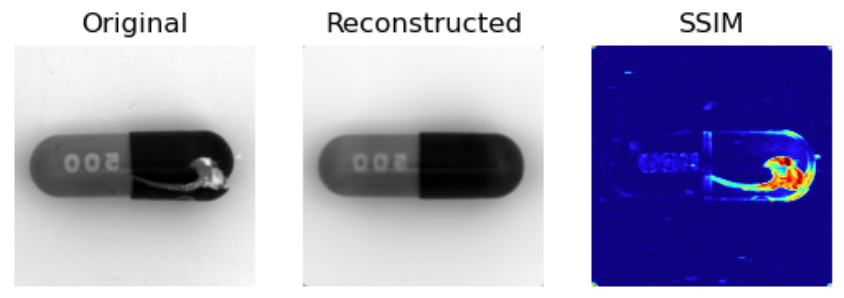

# Anomaly Detection for Quality Control

----------

----------

## Introduction

This notebook project aims to provide an easy-to-use implementation of a simple autoencoder model for detecting anomalies on defected parts or texture images, inlcuded in the MVTec industrial dataset used for training. Presented method is unsupervised, the model is trained on the defect-free images of one of the MVTec datasets and can detect various kinds of defects in the test images. As a loss function and also a evaluation metric, structural similarity index measure (SSIM) method have been used [SSIM Pytorch implementation](https://github.com/VainF/pytorch-msssim).
The project was implemented in Jupyter Notebook to provide a simple environment for further experimentation with neural network architecture, hyperparameters and input data.

## Data
MVTec dataset consists of 17 subsets including jointly 5354 images of different objects and textures. Used datasets are available on the MVTec company website [here](https://www.mvtec.com/company/research/datasets/mvtec-ad).

### Directory Structure
Downloaded datasets should be in directory data/
Required directory stucture:

    ├── metal_nut
    │   ├── ground_truth
    │   │   ├── bent
    │   │   ├── color
    │   │   ├── flip
    │   │   └── scratch
    │   ├── test
    │   │   ├── bent
    │   │   ├── color
    │   │   ├── flip
    │   │   ├── scratch
    │   │   └── good
    │   └── train
    │       └── good
    ...

##  Dependencies
Main libraries used in this project:
* `torch == 1.13.1`
* `torchvision == 0.14.1`
* `numpy == 1.21.5`

## Results

## License
This project is licensed under the MIT License - see the LICENSE.md file for details

## References
* https://github.com/VainF/pytorch-msssim
* https://github.com/PabloMaj/Unsupervised-Anomaly-Detection-with-SSIM-AE
* Bergmann, Paul, et al. -- Improving unsupervised defect segmentation by applying structural similarity to autoencoders, 2018