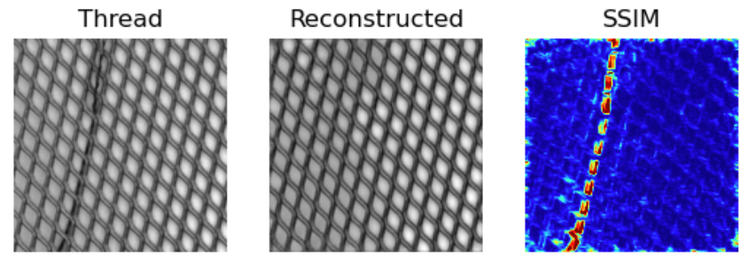
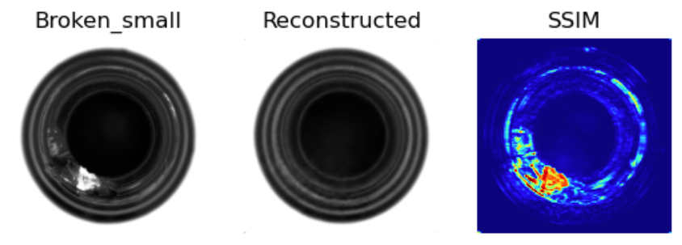

# Anomaly Detection for Quality Control

----------

----------

## Introduction

This notebook project aims to provide an easy-to-use implementation of a simple autoencoder model for detecting anomalies on defected parts or texture images, included in the MVTec industrial dataset. Presented method is unsupervised, the model is trained on defect-free images of one of the MVTec datasets and can detect various kinds of defects in the test images. As a loss function and also an evaluation metric, structural similarity index measure (SSIM) method have been used ([SSIM Pytorch implementation](https://github.com/VainF/pytorch-msssim)).

## Data
MVTec dataset consists of 17 subsets including jointly 5354 images of different objects and textures. Used datasets are available on the MVTec company website [here](https://www.mvtec.com/company/research/datasets/mvtec-ad).

### Directory Structure
Downloaded datasets should be in directory data/  
Required directory stucture:

    ├── metal_nut
    │   ├── ground_truth
    │   │   ├── bent
    │   │   ├── color
    │   │   ├── flip
    │   │   └── scratch
    │   ├── test
    │   │   ├── bent
    │   │   ├── color
    │   │   ├── flip
    │   │   ├── scratch
    │   │   └── good
    │   └── train
    │       └── good
    ...

##  Dependencies
Main libraries used in this project:
* `torch >= 2.0.0`
* `torchvision == 0.14.1`
* `numpy == 1.22`

For the rest of the dependencies take a look at requirements.txt.

## Results

 

### CAPSULE

### GRID

### BOTTLE

## License
Project is licensed under the MIT License - see the LICENSE.md file for details

## References
* https://github.com/VainF/pytorch-msssim
* https://github.com/PabloMaj/Unsupervised-Anomaly-Detection-with-SSIM-AE
* Bergmann, Paul, et al. -- Improving unsupervised defect segmentation by applying structural similarity to autoencoders, 2018